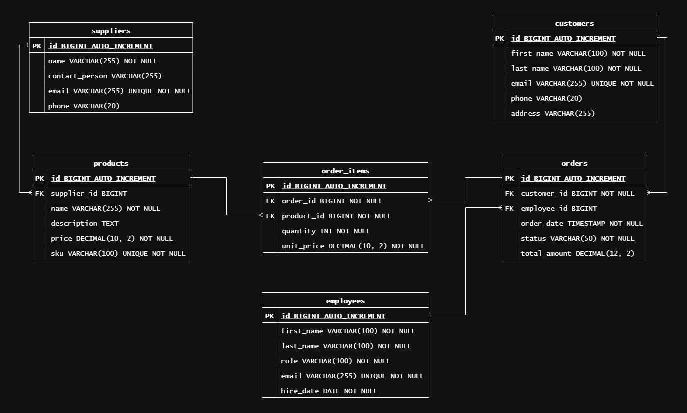

# Nexus API

## 📝 Descrição do Projeto

Back-end service para o projeto Nexus, atuando como a fonte única da verdade (Single Source of Truth) para os dados mestres da empresa. A API centraliza o ciclo de vida de Clientes, Fornecedores, Produtos, Funcionários e Pedidos, garantindo a consistência e integridade das informações através de um serviço web RESTful.

## 🚀 Tecnologias Utilizadas

- **Java 21**: Versão mais recente da linguagem Java (LTS).
- **Spring Boot 3**: Framework principal para a criação da aplicação.
- **Spring Data JPA**: Para persistência de dados de forma abstraída.
- **H2 Database**: Banco de dados em memória para agilidade no desenvolvimento e testes.
- **Maven**: Gerenciador de dependências e _build_ do projeto.
- **Lombok**: Para redução de código boilerplate nas entidades e DTOs.
- **JUnit 5 & MockMvc**: Para a suíte de testes de integração.

## 🏛️ Arquitetura

O projeto foi desenvolvido seguindo os princípios da arquitetura em camadas para garantir a separação de responsabilidades, manutenibilidade e testabilidade.

- **`Controller`**: Camada mais externa, responsável por expor os endpoints REST, receber as requisições HTTP e retornar as respostas. Ela delega toda a lógica de negócio para a camada de Serviço.
- **`Service`**: O coração da aplicação. Contém toda a lógica de negócio, orquestra as operações, gerencia as transações e faz a comunicação entre os `Controllers` e os `Repositories`.
- **`Repository`**: Camada de acesso a dados, responsável pela comunicação com o banco de dados. Utiliza o Spring Data JPA para abstrair as queries.
- **`Model` (Entidades)**: Representação das tabelas do banco de dados como objetos Java (POJOs) através do JPA.
- **`DTO` (Data Transfer Object)**: Define o "contrato" da API. São os objetos que trafegam nas requisições e respostas, desacoplando a camada da API do modelo interno de dados.
- **`Exception`**: Camada com um handler global (`@RestControllerAdvice`) para capturar e tratar exceções, padronizando as respostas de erro da API.

## 📋 Diagrama Entidade-Relacionamento (DER)

O modelo de dados foi planejado para representar as entidades centrais de um negócio e seus relacionamentos, garantindo a integridade referencial.



## ✅ Análise e Justificativa das Tarefas

Esta seção detalha as escolhas técnicas feitas para cumprir os requisitos do teste.

### 1. Gerenciamento de Dependências

As dependências foram gerenciadas pelo Maven através do arquivo `pom.xml`, gerado inicialmente pelo Spring Initializr. As dependências principais escolhidas foram:
- **`spring-boot-starter-web`**: Essencial para a criação de APIs REST, incluindo o servidor Tomcat embutido.
- **`spring-boot-starter-data-jpa`**: Escolhida para facilitar a persistência de dados, abstraindo o acesso ao banco através do padrão de repositório.
- **`h2database`**: Selecionada por ser um banco de dados em memória, o que elimina a necessidade de configuração externa e acelera o ciclo de desenvolvimento e a execução de testes.
- **`spring-boot-starter-validation`**: Utilizada para implementar validações nos DTOs de forma declarativa (`@NotBlank`, `@Email`), garantindo a integridade dos dados na entrada da API.
- **`lombok`**: Adicionada para reduzir drasticamente o código boilerplate (getters, setters, construtores), tornando as classes de modelo mais limpas e legíveis.
- **`spring-boot-starter-test`**: Pacote padrão para testes em Spring Boot, provendo JUnit 5, Mockito e MockMvc, que foram usados para criar uma suíte de testes de integração completa.

### 2. Validação dos Códigos de Status HTTP

A validação dos códigos de status foi implementada para seguir as especificações RESTful, utilizando o objeto `ResponseEntity` nos `Controllers`. As principais escolhas foram:
- **`201 Created`**: Para requisições `POST` bem-sucedidas, indicando que um novo recurso foi criado.
- **`200 OK`**: Para requisições `GET` e `PUT` bem-sucedidas.
- **`204 No Content`**: Para requisições `DELETE` bem-sucedidas, indicando que a operação foi executada, mas não há conteúdo para retornar.
- **`404 Not Found`**: Retornado automaticamente pelo nosso `GlobalExceptionHandler` quando uma `EntityNotFoundException` é lançada pelo serviço, indicando que o recurso solicitado não existe.
- **`400 Bad Request`**: Retornado pelo `GlobalExceptionHandler` para erros de negócio, como a tentativa de criar um recurso com um e-mail que já existe (`IllegalArgumentException`).
- **`409 Conflict`**: Retornado pelo `GlobalExceptionHandler` para ações que conflitam com o estado atual do recurso, como tentar cancelar um pedido que já foi enviado (`IllegalStateException`).

### 3. Desenvolvimento de Serviços REST com Persistência

A aplicação foi desenvolvida com Spring Boot, utilizando as anotações `@RestController` e `@RequestMapping` para definir os endpoints. A persistência foi implementada com JPA/Hibernate, mapeando as entidades Java para as tabelas do banco de dados H2. O design seguiu os padrões RESTful, utilizando os verbos HTTP (`GET`, `POST`, `PUT`, `DELETE`) para representar as operações CRUD.

### 4. Desenvolvimento de Testes no Serviço REST

A estratégia de testes adotada foi focada em **testes de integração** para a camada de `Controller`. Essa escolha foi feita porque este tipo de teste oferece o melhor custo-benefício, validando o fluxo completo da aplicação — do recebimento da requisição HTTP à interação com o banco de dados. Utilizamos:
- **`@SpringBootTest`** para carregar o contexto da aplicação.
- **`@AutoConfigureMockMvc`** para injetar o `MockMvc`.
- **`MockMvc`** para simular requisições HTTP e fazer asserções sobre as respostas.
- **`@Transactional`** em cada classe de teste para garantir que cada teste rode em uma transação isolada que é revertida ao final, evitando que um teste interfira no outro.

## 💻 Guia de Instalação e Execução

**Pré-requisitos:**
- Java 21 ou superior
- Maven 3.8 ou superior

**Passos:**
1. Clone o repositório:
   ```bash
   git clone git@github.com:LeandroMedvedev/nexus.git
   ```
2. Navegue até a pasta do projeto:
   ```bash
   cd nexus
   ```
3. Execute a aplicação:
   ```bash
   mvn spring-boot:run
   ```
A API estará disponível em `http://localhost:8080`.

## 📡 Exemplos de Uso dos Endpoints

A seguir, exemplos de como interagir com o endpoint de `Customers`. O mesmo padrão se aplica às outras entidades.

### Criar um Novo Cliente

- **Método:** `POST`
- **URL:** `/api/v1/customers`
- **Corpo da Requisição (Body):**
  ```json
  {
    "firstName": "Doug",
    "lastName": "Heffernan",
    "email": "doug.h@ips.com",
    "phone": "555-1234",
    "address": "Queens, NY"
  }
  ```
- **Resposta de Sucesso (Código `201 Created`):**
  ```json
  {
    "id": 1,
    "firstName": "Doug",
    "lastName": "Heffernan",
    "email": "doug.h@ips.com",
    "phone": "555-1234",
    "address": "Queens, NY"
  }
  ```
- **Resposta de Erro (Código `400 Bad Request` - E-mail duplicado):**
  ```json
  {
    "statusCode": 400,
    "message": "Customer with email doug.h@ips.com already exists.",
    "timestamp": "2025-09-22T23:50:14.732Z"
  }
  ```

### Buscar um Cliente por ID

- **Método:** `GET`
- **URL:** `/api/v1/customers/1`
- **Resposta de Sucesso (Código `200 OK`):**
  ```json
  {
    "id": 1,
    "firstName": "Doug",
    "lastName": "Heffernan",
    "email": "doug.h@ips.com",
    "phone": "555-1234",
    "address": "Queens, NY"
  }
  ```

## ✒️ Autor


**[Leandro Medvedev]**
